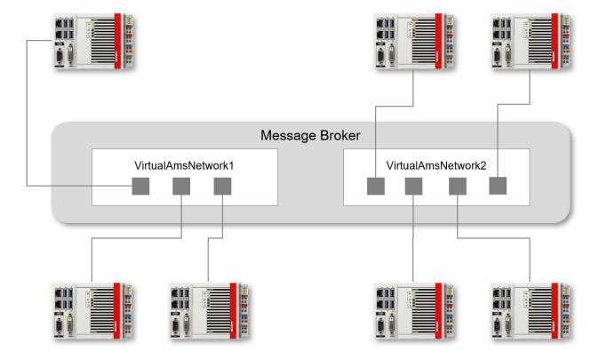

# How To

### Prerequisited

- install git
```
    doas pkg install git
```

- clone repository

```
git clone <url>
```

- change directory
```
cd <dir>
```

- change permision on `setup.sh` to allow execution
```
chmod 700 setup.sh
```

- run script
```
./setup.sh
```

### Usage

the script asks user to select a configuration from : 
- prod
- test
- dev
please type in your choice and confirm with `Enter`

Devices will be able to talk only with other devices on the same Network



script will set the desired configuration and restart the ADS Router
at the end a connection check to the MQTT broker is performed.


